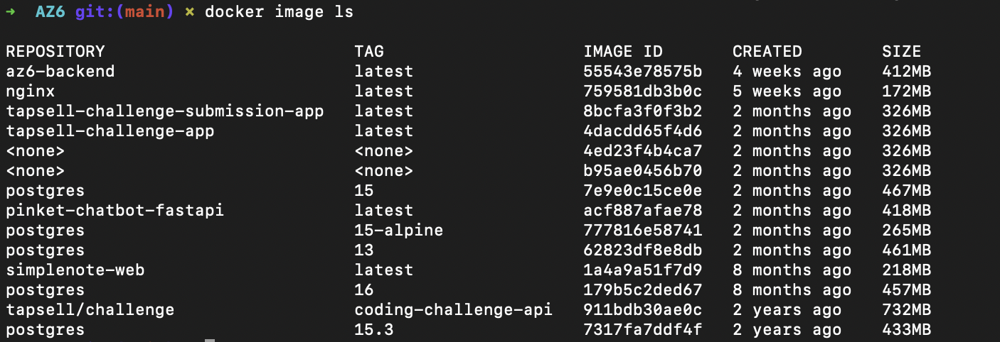
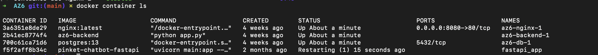
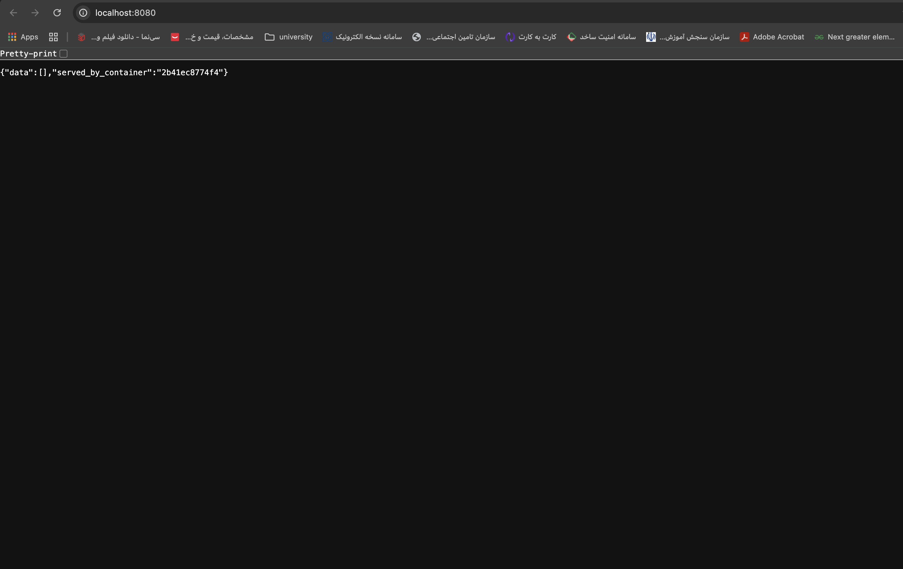
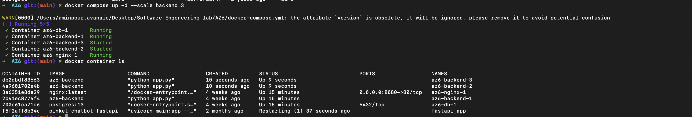

# گزارش آزمایش استقرار میکروسرویس با داکر


## ۱. معماری سیستم
این سامانه شامل سه بخش اصلی است:
1.  **Interface (Nginx):** به عنوان Load Balancer عمل می‌کند و روی پورت 8080 گوش می‌دهد.
2.  **Backend (Python Flask):** لاجیک برنامه و اتصال به دیتابیس را انجام می‌دهد.
3.  **Database (PostgreSQL):** محل ذخیره‌سازی داده‌ها.

تمامی سرویس‌ها با استفاده از `docker-compose` مدیریت می‌شوند.

## ۲. وضعیت سرویس‌ها و ایمیج‌ها
پس از اجرای دستور `docker compose up -d --build`، وضعیت کانتینرها و ایمیج‌ها به شرح زیر است:

`docker image`:

`docker container`:

## ۳. تست عملکرد سامانه
با فراخوانی آدرس `localhost:8080`، درخواست توسط Nginx به Backend ارسال شده و پاسخ JSON شامل شناسه کانتینر دریافت می‌شود:


`localhost`:

## ۴. مقیاس‌پذیری (Scaling)
برای پاسخ به سناریوی افزایش کاربران، بدون تغییر در کد برنامه، سرویس Backend را Scale کردیم.
با اجرای دستور زیر، تعداد کانتینرهای Backend به ۳ عدد افزایش یافت:
```bash
docker compose up -d --scale backend=3
```

پس از این کار، با رفرش کردن صفحه در مرورگر، مشاهده می‌کنیم که فیلد `served_by_container` تغییر می‌کند که نشان‌دهنده توزیع موفق بار (Load Balancing) روی کانتینرهای مختلف است.

`scaling`:


## مفهوم Stateless و کاربرد آن در این آزمایش
**Stateless (بی‌حالت)** به این معناست که سرویس Backend هیچ داده‌ای را در حافظه داخلی خود برای استفاده در درخواست‌های بعدی نگه نمی‌دارد و هر درخواست کاملاً مستقل پردازش می‌شود.

**استفاده در این پروژه:**
ما سرویس `backend` را به صورت Stateless طراحی کردیم؛ به این معنی که تمام داده‌ها در `db` (پایگاه داده خارجی) ذخیره می‌شوند.
این ویژگی به ما اجازه داد تا به راحتی سرویس Backend را **Scale** کنیم (تعداد آن را زیاد کنیم). اگر Backend ما Stateless نبود (مثلاً داده‌ها را در متغیرهای پایتون ذخیره می‌کرد)، با افزایش تعداد کانتینرها، داده‌ها بین آن‌ها ناهماهنگ می‌شدند. اما اکنون فرقی نمی‌کند درخواست کاربر به کدام کانتینر برسد، همه آن‌ها به یک دیتابیس مشترک متصل هستند.